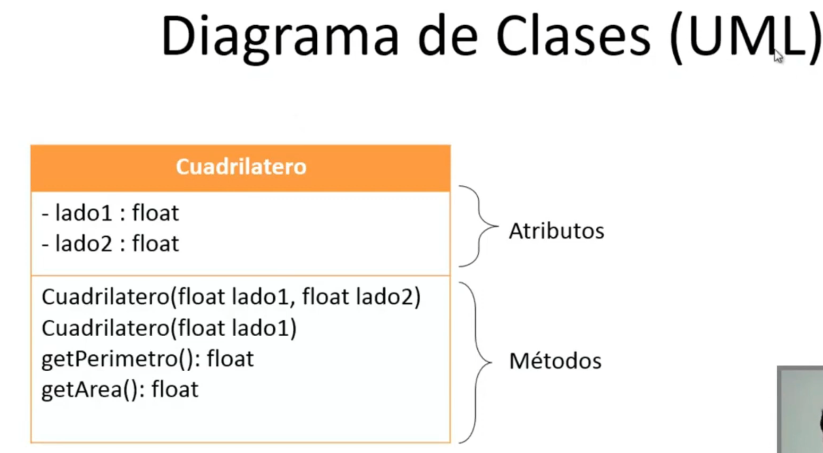
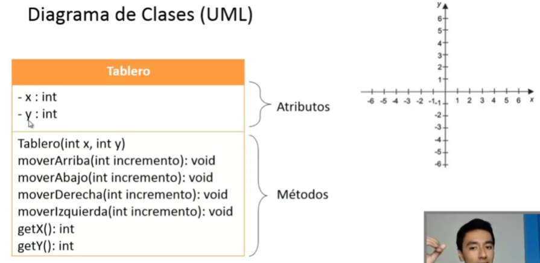
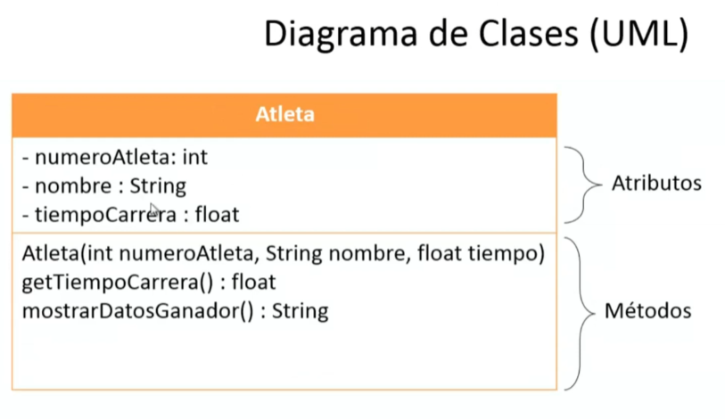
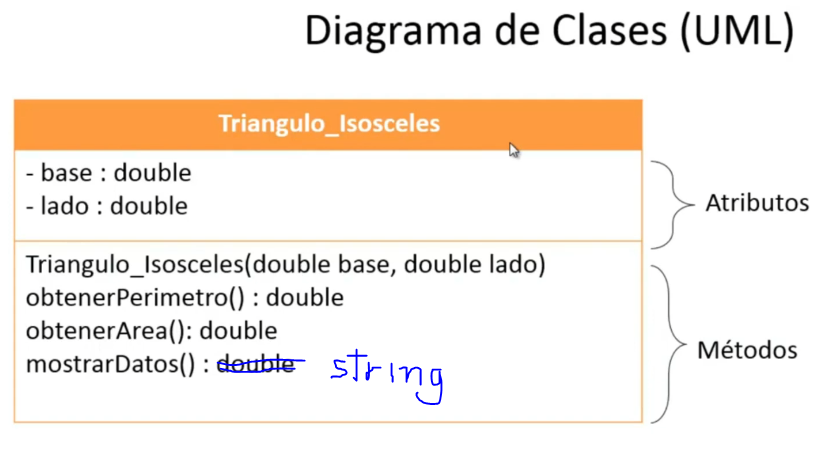
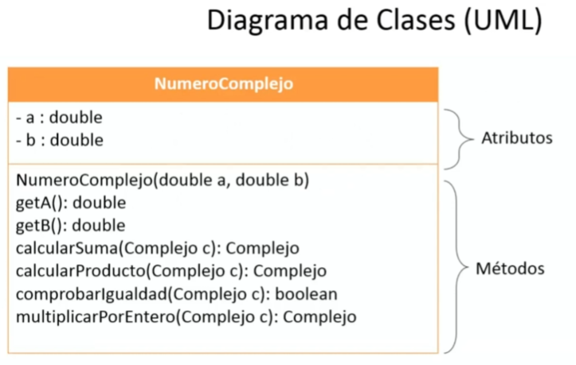

# Seccion 9: Programacion orientada a objetos (POO)
## 115. Miembros estaticos de una clase
- Tambien se les conoce como miembros de clase (ya que no le pertenece al objeto sino solo a la clase)
- Los miembros son los atributos y los metodos
- Para convertir un miembro a estatico tenemos que agregar la palabra static que ira despues del modificador de acceso.
Ejemplo:    private static numero = 1;
Al yo agregar static y posteriormente agrego un cambio en algun atributo no importa en que objeto este repercute y se asignara el ultimo cambio la cual sera el definitivo para todos los objetos

**Sin static**
```java
public class Estatico {
    private String frase = "Primera frase";
    public static void main(String[] args) {
        Estatico ob1 = new Estatico();
        Estatico ob2 = new Estatico();
        
        ob2.frase = "Segunda frase";
        
        System.out.println(ob1.frase);
        System.out.println(ob2.frase);
    }
}
```
Resultado obtenido: 

Primera frase

Segunda frase


**Con static**
```java
public class Estatico {
    private static String frase = "Primera frase";
    public static void main(String[] args) {
        Estatico ob1 = new Estatico();
        Estatico ob2 = new Estatico();
        
        ob2.frase = "Segunda frase";
        
        System.out.println(ob1.frase);
        System.out.println(ob2.frase);
    }
}
```
Resultado obtenido: 

Segunda frase

Segunda frase

Todos los objetos van a compartir ese atributo, que si yo lo cambio en un objeto cambiara para todos los objetos porque ya no le pertenece a cada objeto individual porque ahora es de la clase
- Otra caracteristica que tienen los atributos staticos es que ya no necesitan que instanciemos un objeto para poder utilizarlos. Ejemplo
```java
public class Estatico {
    private static String frase = "Primera frase";
    public static void main(String[] args) {
        //Podemos imprimir sin necesidad de instanciar un objeto
        System.out.println(Estatico.frase);
    }
}
```
Resultado obtenido: 

Primera frase

- Lo mismo ocurre con los metodos estaticos. Ejemplo:
```java
public class Estatico {
    public static int sumar(int n1, int n2){
            int suma = n1 + n2;
            return suma;
        }
    public static void main(String[] args) {
        System.out.println("La suma es: "+Estatico.sumar(3, 4));
    }
}
```
Resultado obtenido:

La suma es: 7

## 116. Ejercicio 1 - Obtener el perimetro y area de un cuadrilatero 
Construir un programa que calcule el area y el perimetro de un cuadrilatero dada la longitud de sus dos lados. Los valores de la longitud deberan introducirse por linea de ordenes. Si es un cuadrado, solo se proporcionara la longitud de uno de los lados al constructor. 

**Solucion**

Diagrama de clases:



```java
package Ejercicio1;
public class Cuadrilatero {
    //Atributos
    private float lado1;
    private float lado2;
    //Metodos
    //Metodo constructor 1 (Cuadrilatero)
    public Cuadrilatero(float lado1, float lado2) {
        this.lado1 = lado1;
        this.lado2 = lado2;
    }
    //Metodo constructor 2 (Cuadrado)
    public Cuadrilatero(float lado1) {
        this.lado1 = this.lado2 = lado1;
    }
    public float getPerimetro(){
        float perimetro = 2 * (lado1 + lado2);
        return perimetro;
    }
    public float getArea(){
        float area = (lado1 * lado2);
        return area;
    }
}
```

```java
package Ejercicio1;
import javax.swing.JOptionPane;
public class Principal {
    public static void main(String[] args) {
        Cuadrilatero c1;
        float lado1,lado2;    
        lado1 = Float.parseFloat(JOptionPane.showInputDialog("Digite el lado1: "));
        lado2 = Float.parseFloat(JOptionPane.showInputDialog("Digite el lado2: "));      
        if(lado1 == lado2){ //Es un cuadrado
            c1 = new Cuadrilatero(lado1);
        }
        else{
            c1 = new Cuadrilatero(lado1, lado2);
        }     
        System.out.println("El perimetro es: "+c1.getPerimetro());
        System.out.println("El area es: "+c1.getArea());
    }
}
```

## 117. Ejercicio 2 - Mover un objeto en un tablero
Construir un programa que permita dirigir el movimiento de un objeto dentro de un tablero y actualice su posicion dentro del mismo. Los movimientos posibles son ARRIBA, ABAJO, IZQUIERDA Y DERECHA. Tras cada movimiento el programa mostrara la nueva direccion elegida y las coordenadas de situacion del objeto dentro del tablero.

**Solucion:**


```java
package Ejercicio2;
public class Tablero {
    private int x;
    private int y;
    //Constructor
    public Tablero(int x, int y) {
        this.x = x;
        this.y = y;
    }
    public void moverArriba(int incremento){
        y+=incremento;
    }
    public void moverAbajo(int incremento){
        y-=incremento;
    }
    public void moverDerecha(int incremento){
        x+=incremento;
    }
    public void moverIzquierda(int incremento){
        x-=incremento;
    }
    public int getX() {
        return x;
    }
    public int getY() {
        return y;
    }
}

```

```java
package Ejercicio2;
import java.util.Scanner;
public class Principal {
    public static void main(String[] args) {
        Scanner entrada = new Scanner(System.in);
        Tablero t1;
        int x,y,opcion,incremento=0;
        System.out.print("Digite la coordenada inicial de X: ");
        x=entrada.nextInt();
        System.out.print("Digite la coordenada inicial de Y: ");
        y=entrada.nextInt();
        //Posicion inicial del objeto
        t1=new Tablero(x, y);
        do {            
            System.out.println("\n\t.:MENU:.");
            System.out.println("1. Mover hacia ARRIBA");
            System.out.println("2. Mover hacia ABAJO");
            System.out.println("3. Mover hacia DERECHA");
            System.out.println("4. Mover hacia IZQUIERDA");
            System.out.println("5. Salir");
            System.out.print("Digite la opcion: ");
            opcion=entrada.nextInt();
            
            if(opcion>=1 && opcion<=4){
                System.out.print("\nDigite la cantidad de espacios a moverse: ");
                incremento = entrada.nextInt();
            }
            switch(opcion){
                case 1: t1.moverArriba(incremento); break;
                case 2: t1.moverAbajo(incremento); break;
                case 3: t1.moverDerecha(incremento); break;
                case 4: t1.moverIzquierda(incremento); break;
                case 5: break;
                default: System.out.print("Error, se equivoco de opcion de menu"); break;
            }
            System.out.print("\nPosicion Actual (X,Y): ("+t1.getX()+" , "+t1.getY()+")"); 
        } while (opcion !=5);
    }
}

```
## 118. Ejercicio 3 - Encontrar el vehiculo mas barato
Construir un programa que dada una serie de vehiculos caracterizados por su marca, modelo y precio, imprima las propiedades del vehiculo mas barato. Para ello, se deberan leer por teclado las caracteristicas de cada vehiculo y crear una clase que represente a cada uno de ellos.

**Solucion:**


```java
package Ejercicio3;
public class Vehiculo {
    private String marca;
    private String modelo;
    private float precio;
    //Constructor
    public Vehiculo(String marca, String modelo, float precio) {
        this.marca = marca;
        this.modelo = modelo;
        this.precio = precio;
    }
    public float getPrecio() {
        return precio;
    }
    public String mostrarDatos(){
        return  "Marca: "+marca+"\nModelo: "+modelo+"\nPrecio: $"+precio+"\n";
    }
}
```

```java
package Ejercicio3;
import java.util.Scanner;
public class Principal {
    public static int indiceCocheMBarato(Vehiculo coches[]){
        float precio;
        int indice = 0;
        
        precio = coches[0].getPrecio();
        for (int i = 1; i < coches.length; i++) {
            if (coches[i].getPrecio()<precio) {
                precio = coches[i].getPrecio();
                indice = i;
            }
        }
        return indice;
    }
    public static void main(String[] args) {
        Scanner entrada = new Scanner(System.in);
        String marca,modelo;
        float precio;
        int numeroVehiculos,indiceBarato;
        
        System.out.print("Digite la cantidad de Vehiculos: ");
        numeroVehiculos = entrada.nextInt();
        
        //Creamos los objetos para los coches
        Vehiculo coches[] = new Vehiculo[numeroVehiculos];
        
        for (int i = 0; i < coches.length; i++) {   //tambien se puede poner numeroVehiculos en vez de coches.length
            entrada.nextLine(); //Corrige errores cuando el programa nos pide string
            System.out.println("Digite las caracteristicas del coche"+(i+1)+": ");
            System.out.print("Introduzca Marca: ");
            marca = entrada.nextLine();
            System.out.print("Introduzca Modelo: ");
            modelo = entrada.nextLine();
            System.out.print("Introduzca Precio: ");
            precio = entrada.nextFloat();
            
            coches[i] = new Vehiculo(marca,modelo, precio);
        }
        indiceBarato = indiceCocheMBarato(coches);
        System.out.println("\nEl coche mas barato es: ");
        System.out.println(coches[indiceBarato].mostrarDatos());
    }
}
```

- Con entrada.nextLine(); corregimos errores que a veces salen cuando ejecutamos programas que nos pidan datos de tipo string. Esto ocurre porque el buffer no queda completamente vacio para poner el siguiente dato
- Para poner datos de tipo decimal en java se tiene que usar el punto y no la coma.

## 119. Ejercicio 4 - Hacer un programa para una competencia de atletismo
Construir un programa para una competencia de atletismo, el programa debe gestionar una serie de atletas caracterizados por su numero de atleta, nombre y tiempo de carrera, al final el programa debe mostrar los datos del atleta ganador de la carrera.



```java
package Ejercicio4;
public class Atleta {
    private int numeroAtleta;
    private String nombre;
    private float tiempoCarrera;
    //Constructor
    public Atleta(int numeroAtleta, String nombre, float tiempoCarrera) {
        this.numeroAtleta = numeroAtleta;
        this.nombre = nombre;
        this.tiempoCarrera = tiempoCarrera;
    }
    public float getTiempoCarrera(){
        return tiempoCarrera;
    }
    public String mostrarDatosGanador(){
        return "Numero de Atleta: "+numeroAtleta+"\nNombre Atleta: "+nombre+"\nTiempo Carrera: "+tiempoCarrera+"\n";
    }
}
```

```java
package Ejercicio4;
import java.util.Scanner;
public class Principal {
    public static int indiceGanador(Atleta atletas[]){
        float tiempoCarrera;
        int indice = 0;
        tiempoCarrera = atletas[indice].getTiempoCarrera();
        for (int i = 1; i < atletas.length; i++) {
            if (atletas[i].getTiempoCarrera()<tiempoCarrera) {
                tiempoCarrera = atletas[i].getTiempoCarrera();
                indice = i;
            } 
        }
        return indice;
    }
    public static void main(String[] args) {
        Scanner entrada = new Scanner(System.in);
        String nombre;
        int numeroAtleta,nAtletas,indiceAtletaGanador;
        float tiempoCarrera;
        
        System.out.print("Digite el numero de atletas a participar: ");
        nAtletas = entrada.nextInt();   
        //Creamos los objetos para cada atleta
        Atleta atletas[] = new Atleta[nAtletas];
        
        for (int i = 0; i < atletas.length; i++) {
            System.out.println("\nDigite los datos del atleta "+(i+1)+": ");
            System.out.print("Introduzca Numero de atleta: ");
            numeroAtleta = entrada.nextInt();
            entrada.nextLine();
            System.out.print("Introduzca Nombre de atleta: ");
            nombre = entrada.nextLine();
            System.out.print("Introduzca tiempo de carrera: ");
            tiempoCarrera = entrada.nextFloat();
            
            atletas[i] = new Atleta(numeroAtleta, nombre, tiempoCarrera);
        }
        indiceAtletaGanador = indiceGanador(atletas);
        System.out.println("\nEl atleta ganador es: ");
        System.out.println(atletas[indiceAtletaGanador].mostrarDatosGanador());
    }
}
```

## 120. Ejercicio 5 - Area y perimetro de triangulos isosceles

Diseñar un programa para trabajar con triangulos isosceles. Para ello defina los atributos necesarios que se requieren, proporcione metodos de consulta, un metodo constructor e implemente metodos para calcular el perimetro y el area de un triangulo, ademas implementar un metodo que a partir de un arreglo de triangulos devuelva el area del triangulo de mayor superficie.



```java
package Ejercicio5;
public class Triangulo_Isosceles {
    private double base;
    private double lado;
    public Triangulo_Isosceles(double base, double lado) {
        this.base = base;
        this.lado = lado;
    }
    public double obtenerPerimetro(){
        double perimetro = 2*lado + base;
        return perimetro;
    }
    public double obtenerArea(){
        double area = (base*Math.sqrt(lado*lado-(base*base)/4))/2;
        return area;
    }
}
```

```java
package Ejercicio5;
import java.util.Scanner;
public class Principal {
    public static double mayorArea(Triangulo_Isosceles triangulos[]){
        double area;
        area = triangulos[0].obtenerArea();
        for (int i = 1; i < triangulos.length; i++) {
            if(triangulos[i].obtenerArea()>area){
                area = triangulos[i].obtenerArea();
            }
        }
        return area;
    }
    public static void main(String[] args) {
        Scanner entrada = new Scanner(System.in);
        double base,lado;
        int nTriangulos;
        System.out.print("Digite el numero de triangulos a ingresar: ");
        nTriangulos = entrada.nextInt();
        Triangulo_Isosceles triangulos[] = new Triangulo_Isosceles[nTriangulos]; 
        for (int i = 0; i < triangulos.length; i++) {
            System.out.println("\nDigite los valores para el triangulo "+(i+1)+":");
            System.out.print("Introduzca la base: ");
            base = entrada.nextDouble();
            System.out.print("Introduzca el lado: ");
            lado = entrada.nextDouble();
            
            triangulos[i] = new Triangulo_Isosceles(base, lado);
            
            System.out.println("\nEl perimetro del triangulo es: "+triangulos[i].obtenerPerimetro());
            System.out.println("El area del triangulo es: "+triangulos[i].obtenerArea());
        }
        System.out.println("\nEl area del triangulo de mayor superficie es: "+mayorArea(triangulos));
    }  
}
```

## 121. Ejercicio 6 - Operaciones con numeros complejos (parte 1)

Construir un programa para trabajar con 2 numeros complejos, implemente el siguiente menu:
1. Sumar dos numeros complejos
2. Multiplicar 2 numeros complejos
3. Comparar 2 numeros complejos (iguales o no)
4. Multiplicar un numero complejo por un entero




# Seccion 13: Interfaces Graficas de Usuario (GUI)
## 168. Introduccion al capitulo de Interfaces graficas de usuario
**Objetivos:**
- Crear sus propias aplicaciones graficas en java
- Crear interfaces desde codigo o desde el diseñador de NetBeans
- Utilizar Layouts para sus aplicaciones (layout son diferentes estilos de diseño que podemos poner dentro de las aplicaciones).
- Crear ejecutables .jar
- Crear ejecutables .exe

**Contenido:**
1. Contenedores:

    a) Ventanas (JFrame)

    b) Paneles (JPanel)

2. Componentes:

    a) Etiquetas (JLabel)

    b) Botones (JButton)

    c) Radio Botones (JRadioButton)

    d) Botones de Activacion (JToggleButton)

    e) Caja de texto (JTextField)

    f) Area de texto (JTextArea)

    g) Casillas de verificacion (JCheckBox)

    h) Listas desplegables (JComboBox)

    i) Campo de contraseña (JPasswordField)

    j) Tablas (JTable)

    k) Listas (JList)

3. Eventos:

    a) Oyente de accion (ActionListener)

    b) Oyente de raton (MouseListener)

    c) Metodos de los eventos de raton (MouseEvent)

    d) Oyente del movimiento del raton (MouseMotionListener)

    e) Oyente de la rueda del raton (MouseWheelListener)

    f) Oyente de teclado (KeyListener)

4. Ejercicio 1: Contabilizar clics

5. Ejercicio 2: Escoger deporte favorito

6. Ejercicio 3: Jugar con los colores RGB

7. El diseñador de Interfaces Graficas de NetBeans

8. Ejercicio 4: Interfaz para un grupo de personas

9. Ejercicio 5: Desarrollando un cronometro

10. Ejercicio 6: Interfaz grafica para un login

11. Diseño (Layout):

    a) FlowLayout

    b) BoxLayout

    c) BorderLayout

    d) GridLayout

    e) GridBagLayout

12. Ejercicio 7: Cartelera de cine

13. Barra de menu

    a) Creacion de una Barra de Menu

    b) Submenu y componentes de la Barra de Menu

    c) Menu Desplegable (JPopupMenu)

14. Estilos de Ventana (LookAndFeel)

15. Descargar mas estilos de Ventana (LookAndFeel)

16. Ejercicio 8: Calculadora y Conversor de Divisas

17. Crear ventanas secundarias (JDialog)

18. Mostrar datos en arbol jerarquico (JTree)

19. Eventos en el JTree

20. Ejercicio 9 - Juego de 3 en Raya

21. Crear un ejecutable .exe

# 169. Ventanas (JFrame) - creacion de una ventana

```java
package ventana;
import javax.swing.JFrame;
public class Ventana extends JFrame{
    public Ventana(){
        this.setSize(500, 500); //Establecemos el tamaño de la ventana
    }
}
```

```java
package ventana;
public class Principal {
    public static void main(String[] args) {
        Ventana v1 = new Ventana();
        v1.setVisible(true); //Hacemos visible la ventana
    }
}
```

# 170. Ventanas (JFrame) - Cierre de ventana y titulo

```java
package ventana;
import javax.swing.JFrame;
public class Ventana extends JFrame{
    public Ventana(){
        setSize(500, 500); //Establecemos el tamaño de la ventana
        setDefaultCloseOperation(EXIT_ON_CLOSE);
        setTitle("El mejor titulo"); //Establecemos el titulo de la ventana
    }
}
```

# 171. Ventanas (JFrame) - Posicion inicial de la ventana

```java
package ventana;
import javax.swing.JFrame;
public class Ventana extends JFrame{
    public Ventana(){
        setSize(500, 500); //Establecemos el tamaño de la ventana
        setTitle("El mejor titulo"); //Establecemos el titulo de la ventana
        //setLocation(100, 200); // Establecemos la posicion inicial de la ventana
        //setBounds(100, 200, 500, 500); //Juntamos el setlocation con setsize
        setLocationRelativeTo(null); //Establecemos la ventana en el centro   
        setDefaultCloseOperation(EXIT_ON_CLOSE);
    }
}
```

# 172. Ventanas (JFrame) - Redimensionar y color de la ventana
```java
package ventana;
import java.awt.Color;
import java.awt.Dimension;
import javax.swing.JFrame;
public class Ventana extends JFrame{
    public Ventana(){
        setSize(500, 500); //Establecemos el tamaño de la ventana
        setTitle("El mejor titulo"); //Establecemos el titulo de la ventana
        //setLocation(100, 200); // Establecemos la posicion inicial de la ventana
        //setBounds(100, 200, 500, 500); //Juntamos el setlocation con setsize
        setLocationRelativeTo(null); //Establecemos la ventana en el centro
        
        //setResizable(false); //Establecemos si la ventana puede cambiar de tamaño o no
        setMinimumSize(new Dimension(200,200)); //Establecemos el tamaño minimo
        
        this.getContentPane().setBackground(Color.blue);//Establecer el color de la ventana
        
        setDefaultCloseOperation(EXIT_ON_CLOSE);
    }
}
```
# 173. Panel (JPanel) - Creacion de un panel
```java
package ventana;
import java.awt.Color;
import java.awt.Dimension;
import javax.swing.JFrame;
import javax.swing.JPanel;
public class Ventana extends JFrame{
    public Ventana(){
        setSize(500, 500);
        setTitle("El mejor titulo"); 
        setLocationRelativeTo(null);
        setMinimumSize(new Dimension(200,200)); 
        iniciarComponentes();
        
        setDefaultCloseOperation(EXIT_ON_CLOSE);
    }
    private void iniciarComponentes(){
        JPanel panel = new JPanel(); //Creacion de un panel
        this.getContentPane().add(panel);//Agregamos el panel a la ventana
        panel.setBackground(Color.GREEN); //Establecemos el color del panel
    }
}
```

# 174. Etiquetas (JLabel) - Creacion de una etiqueta
```java
package ventana;
import java.awt.Color;
import java.awt.Dimension;
import javax.swing.JFrame;
import javax.swing.JLabel;
import javax.swing.JPanel;
public class Ventana extends JFrame{
    public Ventana(){
        setSize(500, 500);
        setTitle("El mejor titulo"); 
        setLocationRelativeTo(null);
        setMinimumSize(new Dimension(200,200)); 
        iniciarComponentes();
        
        setDefaultCloseOperation(EXIT_ON_CLOSE);
    }
    private void iniciarComponentes(){
        JPanel panel = new JPanel(); //Creacion de un panel
        panel.setLayout(null); //Desactivamos el diseño por defecto
        this.getContentPane().add(panel);//Agregamos el panel a la ventana
        //panel.setBackground(Color.GREEN); //Establecemos el color del panel
        JLabel etiqueta = new JLabel(); //Creamos una etiqueta
        etiqueta.setText("Hola"); //Establecemos el texto de la etiqueta
        etiqueta.setBounds(100, 100, 50, 30);
        panel.add(etiqueta); //Agregamos la etiqueta al panel
    }
}
```
# 175. Etiquetas (JLabel) - Cambiar el color de letra y el fondo

```java
package ventana;
import java.awt.Color;
import java.awt.Dimension;
import javax.swing.JFrame;
import javax.swing.JLabel;
import javax.swing.JPanel;
public class Ventana extends JFrame{
    public Ventana(){
        setSize(500, 500);
        setTitle("El mejor titulo"); 
        setLocationRelativeTo(null);
        setMinimumSize(new Dimension(200,200)); 
        iniciarComponentes();
        
        setDefaultCloseOperation(EXIT_ON_CLOSE);
    }
    private void iniciarComponentes(){
        JPanel panel = new JPanel(); //Creacion de un panel
        panel.setLayout(null); //Desactivamos el diseño por defecto
        this.getContentPane().add(panel);//Agregamos el panel a la ventana
        //panel.setBackground(Color.GREEN); //Establecemos el color del panel
        JLabel etiqueta = new JLabel(); //Creamos una etiqueta
        etiqueta.setText("Hola"); //Establecemos el texto de la etiqueta
        etiqueta.setBounds(10, 10, 30, 20);
        etiqueta.setForeground(Color.WHITE);//Establecemos el color de la letra
        etiqueta.setOpaque(true);//Establecemos pintar el fondo de la etiqueta
        etiqueta.setBackground(Color.black);
        panel.add(etiqueta); //Agregamos la etiqueta al panel
    }
}
```

# 176. Etiquetas (JLabel) - Cambiar ubicación del texto
```java
package ventana;
import java.awt.Color;
import java.awt.Dimension;
import javax.swing.JFrame;
import javax.swing.JLabel;
import javax.swing.JPanel;
import javax.swing.SwingConstants;
public class Ventana extends JFrame{
    public Ventana(){
        setSize(500, 500);
        setTitle("El mejor titulo"); 
        setLocationRelativeTo(null);
        setMinimumSize(new Dimension(200,200)); 
        iniciarComponentes();
        
        setDefaultCloseOperation(EXIT_ON_CLOSE);
    }
    private void iniciarComponentes(){
        JPanel panel = new JPanel(); //Creacion de un panel
        panel.setLayout(null); //Desactivamos el diseño por defecto
        this.getContentPane().add(panel);//Agregamos el panel a la ventana
        //panel.setBackground(Color.GREEN); //Establecemos el color del panel
        JLabel etiqueta = new JLabel(); //Creamos una etiqueta
        etiqueta.setText("Hola"); //Establecemos el texto de la etiqueta
        etiqueta.setHorizontalAlignment(SwingConstants.CENTER);//Establecemos la alineacion horizontal del texto
        etiqueta.setBounds(10, 10, 80, 20);
        etiqueta.setForeground(Color.WHITE);//Establecemos el color de la letra
        etiqueta.setOpaque(true);//Establecemos pintar el fondo de la etiqueta
        etiqueta.setBackground(Color.black);
        panel.add(etiqueta); //Agregamos la etiqueta al panel
    }
}
```

# 177. Etiquetas (JLabel) - Modificar fuente del texto
```java
package ventana;
import java.awt.Color;
import java.awt.Dimension;
import java.awt.Font;
import javax.swing.JFrame;
import javax.swing.JLabel;
import javax.swing.JPanel;
import javax.swing.SwingConstants;
public class Ventana extends JFrame{
    public Ventana(){
        setSize(500, 500);
        setTitle("El mejor titulo"); 
        setLocationRelativeTo(null);
        setMinimumSize(new Dimension(200,200)); 
        iniciarComponentes();
        
        setDefaultCloseOperation(EXIT_ON_CLOSE);
    }
    private void iniciarComponentes(){
        JPanel panel = new JPanel(); //Creacion de un panel
        panel.setLayout(null); //Desactivamos el diseño por defecto
        this.getContentPane().add(panel);//Agregamos el panel a la ventana
        //panel.setBackground(Color.GREEN); //Establecemos el color del panel
        JLabel etiqueta = new JLabel(); //Creamos una etiqueta
        etiqueta.setText("Hola"); //Establecemos el texto de la etiqueta
        etiqueta.setHorizontalAlignment(SwingConstants.CENTER);//Establecemos la alineacion horizontal del texto
        etiqueta.setBounds(10, 10, 90, 40);
        etiqueta.setForeground(Color.WHITE);//Establecemos el color de la letra
        etiqueta.setOpaque(true);//Establecemos pintar el fondo de la etiqueta
        etiqueta.setBackground(Color.black);
        etiqueta.setFont(new Font("arial",Font.ITALIC,30));
        panel.add(etiqueta); //Agregamos la etiqueta al panel
    }
}
```

# 178. Etiquetas (JLabel) - Etiqueta tipo imagen
```java
package ventana;
import java.awt.Color;
import java.awt.Dimension;
import java.awt.Font;
import javax.swing.ImageIcon;
import javax.swing.JFrame;
import javax.swing.JLabel;
import javax.swing.JPanel;
import javax.swing.SwingConstants;
public class Ventana extends JFrame{
    public Ventana(){
        setSize(900, 900);
        setTitle("El mejor titulo"); 
        setLocationRelativeTo(null);
        setMinimumSize(new Dimension(200,200)); 
        iniciarComponentes();
        
        setDefaultCloseOperation(EXIT_ON_CLOSE);
    }
    private void iniciarComponentes(){
        JPanel panel = new JPanel(); //Creacion de un panel
        panel.setLayout(null); //Desactivamos el diseño por defecto
        this.getContentPane().add(panel);//Agregamos el panel a la ventana
        JLabel etiqueta = new JLabel(); //Creamos una etiqueta
        etiqueta.setText("Mundial 2018"); //Establecemos el texto de la etiqueta
        etiqueta.setHorizontalAlignment(SwingConstants.CENTER);//Establecemos la alineacion horizontal del texto
        etiqueta.setBounds(85, 10, 300, 80);
        etiqueta.setForeground(Color.BLACK);//Establecemos el color de la letra
        etiqueta.setFont(new Font("cooper black",0,40));
        panel.add(etiqueta); //Agregamos la etiqueta al panel
        
        //Etiqueta 2 - etiqueta tipo imagen
        JLabel etiqueta2 = new JLabel();
        etiqueta2.setIcon(new ImageIcon("balon.jpg"));
        etiqueta2.setBounds(10, 80, 450, 450);
        panel.add(etiqueta2);
    }
}
```

# 179. Etiquetas (JLabel) - Cambiar el tamaño de la imagen
```java
package ventana;
import java.awt.Color;
import java.awt.Dimension;
import java.awt.Font;
import java.awt.Image;
import javax.swing.ImageIcon;
import javax.swing.JFrame;
import javax.swing.JLabel;
import javax.swing.JPanel;
import javax.swing.SwingConstants;
public class Ventana extends JFrame{
    public Ventana(){
        setSize(900, 900);
        setTitle("El mejor titulo"); 
        setLocationRelativeTo(null);
        setMinimumSize(new Dimension(200,200)); 
        iniciarComponentes();
        
        setDefaultCloseOperation(EXIT_ON_CLOSE);
    }
    private void iniciarComponentes(){
        JPanel panel = new JPanel(); //Creacion de un panel
        panel.setLayout(null); //Desactivamos el diseño por defecto
        this.getContentPane().add(panel);//Agregamos el panel a la ventana
        JLabel etiqueta = new JLabel(); //Creamos una etiqueta
        etiqueta.setText("Mundial 2018"); //Establecemos el texto de la etiqueta
        etiqueta.setHorizontalAlignment(SwingConstants.CENTER);//Establecemos la alineacion horizontal del texto
        etiqueta.setBounds(230, 10, 300, 80);
        etiqueta.setForeground(Color.BLACK);//Establecemos el color de la letra
        etiqueta.setFont(new Font("cooper black",0,40));
        panel.add(etiqueta); //Agregamos la etiqueta al panel
        
        //Etiqueta 2 - etiqueta tipo imagen
        ImageIcon imagen = new ImageIcon("balon.jpg");
        JLabel etiqueta2 = new JLabel();
        etiqueta2.setBounds(10, 80, 750, 555);
        etiqueta2.setIcon(new ImageIcon(imagen.getImage().getScaledInstance(etiqueta2.getWidth(),etiqueta2.getHeight(),Image.SCALE_SMOOTH)));
        panel.add(etiqueta2);
    }
}
```
# 180. Botones (JButton) - Crear un boton
```java
package ventana;
import java.awt.Color;
import java.awt.Dimension;
import java.awt.Font;
import java.awt.Image;
import javax.swing.ImageIcon;
import javax.swing.JButton;
import javax.swing.JFrame;
import javax.swing.JLabel;
import javax.swing.JPanel;
import javax.swing.SwingConstants;
public class Ventana extends JFrame{
    public JPanel panel;
    
    public Ventana(){
        setSize(900, 900);
        setTitle("El mejor titulo"); 
        setLocationRelativeTo(null);
        setMinimumSize(new Dimension(200,200)); 
        iniciarComponentes();
        
        setDefaultCloseOperation(EXIT_ON_CLOSE);
    }
    private void iniciarComponentes(){
        colocarPaneles();
        //colocarEtiquetas();
        colocarBotones();
    }
    private void colocarPaneles(){
        panel = new JPanel(); //Creacion de un panel
        panel.setLayout(null); //Desactivamos el diseño por defecto
        this.getContentPane().add(panel);//Agregamos el panel a la ventana
    }
    private void colocarEtiquetas(){
        JLabel etiqueta = new JLabel(); //Creamos una etiqueta
        etiqueta.setText("Mundial 2018"); //Establecemos el texto de la etiqueta
        etiqueta.setHorizontalAlignment(SwingConstants.CENTER);//Establecemos la alineacion horizontal del texto
        etiqueta.setBounds(230, 10, 300, 80);
        etiqueta.setForeground(Color.BLACK);//Establecemos el color de la letra
        etiqueta.setFont(new Font("cooper black",0,40));
        panel.add(etiqueta); //Agregamos la etiqueta al panel
        
        //Etiqueta 2 - etiqueta tipo imagen
        ImageIcon imagen = new ImageIcon("balon.jpg");
        JLabel etiqueta2 = new JLabel();
        etiqueta2.setBounds(10, 80, 750, 555);
        etiqueta2.setIcon(new ImageIcon(imagen.getImage().getScaledInstance(etiqueta2.getWidth(),etiqueta2.getHeight(),Image.SCALE_SMOOTH)));
        panel.add(etiqueta2);
    }
    private void colocarBotones(){
        JButton boton1 = new JButton();
        boton1.setText("Click");//Establecemos un texto al boton
        boton1.setBounds(100, 100, 100, 40);
        boton1.setEnabled(true);//Habilita o desabilita un boton
        boton1.setMnemonic('b');//Establecemeos alt+letra
        panel.add(boton1);
    }
}
```

# 181. Botones (JButton) - Ajustes del boton (Texto)
```java
package ventana;
import java.awt.Color;
import java.awt.Dimension;
import java.awt.Font;
import java.awt.Image;
import javax.swing.ImageIcon;
import javax.swing.JButton;
import javax.swing.JFrame;
import javax.swing.JLabel;
import javax.swing.JPanel;
import javax.swing.SwingConstants;
public class Ventana extends JFrame{
    public JPanel panel;
    
    public Ventana(){
        setSize(900, 900);
        setTitle("El mejor titulo"); 
        setLocationRelativeTo(null);
        setMinimumSize(new Dimension(200,200)); 
        iniciarComponentes();
        
        setDefaultCloseOperation(EXIT_ON_CLOSE);
    }
    private void iniciarComponentes(){
        colocarPaneles();
        //colocarEtiquetas();
        colocarBotones();
    }
    private void colocarPaneles(){
        panel = new JPanel(); //Creacion de un panel
        panel.setLayout(null); //Desactivamos el diseño por defecto
        this.getContentPane().add(panel);//Agregamos el panel a la ventana
    }
    private void colocarEtiquetas(){
        JLabel etiqueta = new JLabel(); //Creamos una etiqueta
        etiqueta.setText("Mundial 2018"); //Establecemos el texto de la etiqueta
        etiqueta.setHorizontalAlignment(SwingConstants.CENTER);//Establecemos la alineacion horizontal del texto
        etiqueta.setBounds(230, 10, 300, 80);
        etiqueta.setForeground(Color.BLACK);//Establecemos el color de la letra
        etiqueta.setFont(new Font("cooper black",0,40));
        panel.add(etiqueta); //Agregamos la etiqueta al panel
        
        //Etiqueta 2 - etiqueta tipo imagen
        ImageIcon imagen = new ImageIcon("balon.jpg");
        JLabel etiqueta2 = new JLabel();
        etiqueta2.setBounds(10, 80, 750, 555);
        etiqueta2.setIcon(new ImageIcon(imagen.getImage().getScaledInstance(etiqueta2.getWidth(),etiqueta2.getHeight(),Image.SCALE_SMOOTH)));
        panel.add(etiqueta2);
    }
    private void colocarBotones(){
        JButton boton1 = new JButton();
        boton1.setText("Click");//Establecemos un texto al boton
        boton1.setBounds(100, 100, 100, 40);
        boton1.setEnabled(true);//Habilita o desabilita un boton
        boton1.setMnemonic('b');//Establecemeos alt+letra
        boton1.setForeground(Color.BLUE);
        boton1.setFont(new Font("cooper black", 3, 20));
        panel.add(boton1);
    }
}
```
# 182. Botones (JButton) - Ajustes del boton (Imagenes)
```java
package ventana;
import java.awt.Color;
import java.awt.Dimension;
import java.awt.Font;
import java.awt.Image;
import javax.swing.ImageIcon;
import javax.swing.JButton;
import javax.swing.JFrame;
import javax.swing.JLabel;
import javax.swing.JPanel;
import javax.swing.SwingConstants;
public class Ventana extends JFrame{
    public JPanel panel;
    
    public Ventana(){
        setSize(900, 900);
        setTitle("El mejor titulo"); 
        setLocationRelativeTo(null);
        setMinimumSize(new Dimension(200,200)); 
        iniciarComponentes();
        
        setDefaultCloseOperation(EXIT_ON_CLOSE);
    }
    private void iniciarComponentes(){
        colocarPaneles();
        //colocarEtiquetas();
        colocarBotones();
    }
    private void colocarPaneles(){
        panel = new JPanel(); //Creacion de un panel
        panel.setLayout(null); //Desactivamos el diseño por defecto
        this.getContentPane().add(panel);//Agregamos el panel a la ventana
    }
    private void colocarEtiquetas(){
        JLabel etiqueta = new JLabel(); //Creamos una etiqueta
        etiqueta.setText("Mundial 2018"); //Establecemos el texto de la etiqueta
        etiqueta.setHorizontalAlignment(SwingConstants.CENTER);//Establecemos la alineacion horizontal del texto
        etiqueta.setBounds(230, 10, 300, 80);
        etiqueta.setForeground(Color.BLACK);//Establecemos el color de la letra
        etiqueta.setFont(new Font("cooper black",0,40));
        panel.add(etiqueta); //Agregamos la etiqueta al panel
        
        //Etiqueta 2 - etiqueta tipo imagen
        ImageIcon imagen = new ImageIcon("balon.jpg");
        JLabel etiqueta2 = new JLabel();
        etiqueta2.setBounds(10, 80, 750, 555);
        etiqueta2.setIcon(new ImageIcon(imagen.getImage().getScaledInstance(etiqueta2.getWidth(),etiqueta2.getHeight(),Image.SCALE_SMOOTH)));
        panel.add(etiqueta2);
    }
    private void colocarBotones(){
        //Boton 1 - boton de texto
        JButton boton1 = new JButton();
        boton1.setText("Click");//Establecemos un texto al boton
        boton1.setBounds(100, 100, 100, 40);
        boton1.setEnabled(true);//Habilita o desabilita un boton
        boton1.setMnemonic('b');//Establecemeos alt+letra
        boton1.setForeground(Color.BLUE);
        boton1.setFont(new Font("cooper black", 3, 20));
        panel.add(boton1);
        
        //Boton 2 - boton de imagen
        JButton boton2 = new JButton();
        boton2.setBounds(100, 200, 100, 40);
        //boton2.setOpaque(true);
        ImageIcon imagen2 = new ImageIcon("check.png");
        boton2.setIcon(new ImageIcon(imagen2.getImage().getScaledInstance(boton2.getWidth(), boton2.getHeight(), Image.SCALE_SMOOTH)));
        //boton2.setBackground(Color.blue);
        panel.add(boton2);
    }
}
```

# 183. Botones (JButton) - Borde del boton
```java
package ventana;
import java.awt.Color;
import java.awt.Dimension;
import java.awt.Font;
import java.awt.Image;
import javax.swing.BorderFactory;
import javax.swing.ImageIcon;
import javax.swing.JButton;
import javax.swing.JFrame;
import javax.swing.JLabel;
import javax.swing.JPanel;
import javax.swing.SwingConstants;
public class Ventana extends JFrame{
    public JPanel panel;
    
    public Ventana(){
        setSize(900, 900);
        setTitle("El mejor titulo"); 
        setLocationRelativeTo(null);
        setMinimumSize(new Dimension(200,200)); 
        iniciarComponentes();
        
        setDefaultCloseOperation(EXIT_ON_CLOSE);
    }
    private void iniciarComponentes(){
        colocarPaneles();
        //colocarEtiquetas();
        colocarBotones();
    }
    private void colocarPaneles(){
        panel = new JPanel(); //Creacion de un panel
        panel.setLayout(null); //Desactivamos el diseño por defecto
        this.getContentPane().add(panel);//Agregamos el panel a la ventana
    }
    private void colocarEtiquetas(){
        JLabel etiqueta = new JLabel(); //Creamos una etiqueta
        etiqueta.setText("Mundial 2018"); //Establecemos el texto de la etiqueta
        etiqueta.setHorizontalAlignment(SwingConstants.CENTER);//Establecemos la alineacion horizontal del texto
        etiqueta.setBounds(230, 10, 300, 80);
        etiqueta.setForeground(Color.BLACK);//Establecemos el color de la letra
        etiqueta.setFont(new Font("cooper black",0,40));
        panel.add(etiqueta); //Agregamos la etiqueta al panel
        
        //Etiqueta 2 - etiqueta tipo imagen
        ImageIcon imagen = new ImageIcon("balon.jpg");
        JLabel etiqueta2 = new JLabel();
        etiqueta2.setBounds(10, 80, 750, 555);
        etiqueta2.setIcon(new ImageIcon(imagen.getImage().getScaledInstance(etiqueta2.getWidth(),etiqueta2.getHeight(),Image.SCALE_SMOOTH)));
        panel.add(etiqueta2);
    }
    private void colocarBotones(){
        //Boton 1 - boton de texto
        JButton boton1 = new JButton();
        boton1.setText("Click");//Establecemos un texto al boton
        boton1.setBounds(100, 100, 100, 40);
        boton1.setEnabled(true);//Habilita o desabilita un boton
        boton1.setMnemonic('b');//Establecemeos alt+letra
        boton1.setForeground(Color.BLUE);
        boton1.setFont(new Font("cooper black", 3, 20));
        panel.add(boton1);
        
        //Boton 2 - boton de imagen
        JButton boton2 = new JButton();
        boton2.setBounds(100, 200, 100, 40);
        //boton2.setOpaque(true);
        ImageIcon imagen2 = new ImageIcon("check.png");
        boton2.setIcon(new ImageIcon(imagen2.getImage().getScaledInstance(boton2.getWidth(), boton2.getHeight(), Image.SCALE_SMOOTH)));
        //boton2.setBackground(Color.blue);
        panel.add(boton2);
        
        //Boton 3 - boton de bordes
        JButton boton3 = new JButton();
        boton3.setBounds(100, 300, 110, 50);
        boton3.setBorder(BorderFactory.createLineBorder(Color.blue, 4, true));
        panel.add(boton3);
    }
}
```

# 184. Radio Botones (JRadioButton) - Crear botones de opcion
```java
package ventana;
import java.awt.Color;
import java.awt.Dimension;
import java.awt.Font;
import java.awt.Image;
import javax.swing.BorderFactory;
import javax.swing.ButtonGroup;
import javax.swing.ImageIcon;
import javax.swing.JButton;
import javax.swing.JFrame;
import javax.swing.JLabel;
import javax.swing.JPanel;
import javax.swing.JRadioButton;
import javax.swing.SwingConstants;
public class Ventana extends JFrame{
    public JPanel panel;
    
    public Ventana(){
        setSize(900, 900);
        setTitle("El mejor titulo"); 
        setLocationRelativeTo(null);
        setMinimumSize(new Dimension(200,200)); 
        iniciarComponentes();
        
        setDefaultCloseOperation(EXIT_ON_CLOSE);
    }
    private void iniciarComponentes(){
        colocarPaneles();
        //colocarEtiquetas();
        //colocarBotones();
        colocarRadioBotones();
    }
    private void colocarPaneles(){
        panel = new JPanel(); //Creacion de un panel
        panel.setLayout(null); //Desactivamos el diseño por defecto
        this.getContentPane().add(panel);//Agregamos el panel a la ventana
    }
    private void colocarEtiquetas(){
        JLabel etiqueta = new JLabel(); //Creamos una etiqueta
        etiqueta.setText("Mundial 2018"); //Establecemos el texto de la etiqueta
        etiqueta.setHorizontalAlignment(SwingConstants.CENTER);//Establecemos la alineacion horizontal del texto
        etiqueta.setBounds(230, 10, 300, 80);
        etiqueta.setForeground(Color.BLACK);//Establecemos el color de la letra
        etiqueta.setFont(new Font("cooper black",0,40));
        panel.add(etiqueta); //Agregamos la etiqueta al panel
        
        //Etiqueta 2 - etiqueta tipo imagen
        ImageIcon imagen = new ImageIcon("balon.jpg");
        JLabel etiqueta2 = new JLabel();
        etiqueta2.setBounds(10, 80, 750, 555);
        etiqueta2.setIcon(new ImageIcon(imagen.getImage().getScaledInstance(etiqueta2.getWidth(),etiqueta2.getHeight(),Image.SCALE_SMOOTH)));
        panel.add(etiqueta2);
    }
    
    private void colocarBotones(){
        //Boton 1 - boton de texto
        JButton boton1 = new JButton();
        boton1.setText("Click");//Establecemos un texto al boton
        boton1.setBounds(100, 100, 100, 40);
        boton1.setEnabled(true);//Habilita o desabilita un boton
        boton1.setMnemonic('b');//Establecemeos alt+letra
        boton1.setForeground(Color.BLUE);
        boton1.setFont(new Font("cooper black", 3, 20));
        panel.add(boton1);
        
        //Boton 2 - boton de imagen
        JButton boton2 = new JButton();
        boton2.setBounds(100, 200, 100, 40);
        //boton2.setOpaque(true);
        ImageIcon imagen2 = new ImageIcon("check.png");
        boton2.setIcon(new ImageIcon(imagen2.getImage().getScaledInstance(boton2.getWidth(), boton2.getHeight(), Image.SCALE_SMOOTH)));
        //boton2.setBackground(Color.blue);
        panel.add(boton2);
        
        //Boton 3 - boton de bordes
        JButton boton3 = new JButton();
        boton3.setBounds(100, 300, 110, 50);
        boton3.setBorder(BorderFactory.createLineBorder(Color.blue, 4, true));
        panel.add(boton3);
    }
    
    private void colocarRadioBotones(){
        JRadioButton radioBoton1 = new JRadioButton("Opcion 1", true);
        radioBoton1.setBounds(50, 100, 200, 50);
        radioBoton1.setEnabled(true);
        radioBoton1.setText("Programacion");
        radioBoton1.setFont(new Font("cooper black",0,20));
        panel.add(radioBoton1);
        
        JRadioButton radioBoton2 = new JRadioButton("Opcion 2", false);
        radioBoton2.setBounds(50, 150, 100, 50);
        panel.add(radioBoton2);
        
        JRadioButton radioBoton3 = new JRadioButton("Opcion 3", false);
        radioBoton3.setBounds(50, 200, 100, 50);
        panel.add(radioBoton3);
        
        ButtonGroup grupoRadioBotones = new ButtonGroup();
        grupoRadioBotones.add(radioBoton1);
        grupoRadioBotones.add(radioBoton2);
        grupoRadioBotones.add(radioBoton3);
    }
}
```
# 185. Crear botonoes de activacion (JToggleButton)
```java
package ventana;
import java.awt.Color;
import java.awt.Dimension;
import java.awt.Font;
import java.awt.Image;
import javax.swing.BorderFactory;
import javax.swing.ButtonGroup;
import javax.swing.ImageIcon;
import javax.swing.JButton;
import javax.swing.JFrame;
import javax.swing.JLabel;
import javax.swing.JPanel;
import javax.swing.JRadioButton;
import javax.swing.JToggleButton;
import javax.swing.SwingConstants;
public class Ventana extends JFrame{
    public JPanel panel;
    
    public Ventana(){
        setSize(900, 900);
        setTitle("El mejor titulo"); 
        setLocationRelativeTo(null);
        setMinimumSize(new Dimension(200,200)); 
        iniciarComponentes();
        
        setDefaultCloseOperation(EXIT_ON_CLOSE);
    }
    private void iniciarComponentes(){
        colocarPaneles();
        colocarBotonesDeActivacion();
    }
    private void colocarPaneles(){
        panel = new JPanel(); //Creacion de un panel
        panel.setLayout(null); //Desactivamos el diseño por defecto
        this.getContentPane().add(panel);//Agregamos el panel a la ventana
    }
    
    private void colocarBotonesDeActivacion(){
        JToggleButton botonActivacion1 =  new JToggleButton("Opcion 1",true);
        botonActivacion1.setBounds(50, 100, 100, 40);
        panel.add(botonActivacion1);
        
        JToggleButton botonActivacion2 =  new JToggleButton("Opcion 2",false);
        botonActivacion2.setBounds(50, 150, 100, 40);
        panel.add(botonActivacion2);
        
        JToggleButton botonActivacion3 =  new JToggleButton("Opcion 3",false);
        botonActivacion3.setBounds(50, 200, 100, 40);
        panel.add(botonActivacion3);
        
        ButtonGroup grupoBotonesActivados = new ButtonGroup();
        grupoBotonesActivados.add(botonActivacion1);
        grupoBotonesActivados.add(botonActivacion2);
        grupoBotonesActivados.add(botonActivacion3);
    }
}
```

# 186. Crear una caja de texto (JTextField)
```java
package ventana;
import java.awt.Color;
import java.awt.Dimension;
import java.awt.Font;
import java.awt.Image;
import javax.swing.BorderFactory;
import javax.swing.ButtonGroup;
import javax.swing.ImageIcon;
import javax.swing.JButton;
import javax.swing.JFrame;
import javax.swing.JLabel;
import javax.swing.JPanel;
import javax.swing.JRadioButton;
import javax.swing.JTextField;
import javax.swing.JToggleButton;
import javax.swing.SwingConstants;
public class Ventana extends JFrame{
    public JPanel panel;
    
    public Ventana(){
        setSize(900, 900);
        setTitle("El mejor titulo"); 
        setLocationRelativeTo(null);
        setMinimumSize(new Dimension(200,200)); 
        iniciarComponentes();
        
        setDefaultCloseOperation(EXIT_ON_CLOSE);
    }
    private void iniciarComponentes(){
        colocarPaneles();
        colocarCajasDeTexto();
    }
    private void colocarPaneles(){
        panel = new JPanel(); //Creacion de un panel
        panel.setLayout(null); //Desactivamos el diseño por defecto
        this.getContentPane().add(panel);//Agregamos el panel a la ventana
    }
    
    private void colocarCajasDeTexto(){
        JTextField cajaTexto = new JTextField();
        cajaTexto.setBounds(50, 50, 200, 30);
        cajaTexto.setText("Hola");
        
        System.out.println("Texto en la caja: "+cajaTexto.getText());
        panel.add(cajaTexto);
    }
}
```
# 187. Crear una Area de texto (JTextArea)
```java
package ventana;
import java.awt.Color;
import java.awt.Dimension;
import java.awt.Font;
import java.awt.Image;
import javax.swing.BorderFactory;
import javax.swing.ButtonGroup;
import javax.swing.ImageIcon;
import javax.swing.JButton;
import javax.swing.JFrame;
import javax.swing.JLabel;
import javax.swing.JPanel;
import javax.swing.JRadioButton;
import javax.swing.JTextArea;
import javax.swing.JTextField;
import javax.swing.JToggleButton;
import javax.swing.SwingConstants;
public class Ventana extends JFrame{
    public JPanel panel;
    
    public Ventana(){
        setSize(900, 900);
        setTitle("El mejor titulo"); 
        setLocationRelativeTo(null);
        setMinimumSize(new Dimension(200,200)); 
        iniciarComponentes();
        
        setDefaultCloseOperation(EXIT_ON_CLOSE);
    }
    private void iniciarComponentes(){
        colocarPaneles();
        colocarAreasDeTexto();
        
    }
    private void colocarPaneles(){
        panel = new JPanel(); //Creacion de un panel
        panel.setLayout(null); //Desactivamos el diseño por defecto
        this.getContentPane().add(panel);//Agregamos el panel a la ventana
    }
    
    private void colocarAreasDeTexto(){
        JTextArea areaTexto = new JTextArea();
        areaTexto.setBounds(20, 20, 300, 200);
        areaTexto.setText("Escriba el texto aqui...");
        areaTexto.append("\nEscribe el texto aqui...");//Añade mas texto al area
        areaTexto.setEditable(true);//Editar el area de texto
        
        System.out.println("El texto es: "+ areaTexto.getText());
        panel.add(areaTexto);
    }
}
```

# 188. Agregar barra de desplazamiento(JScrollPane) al area de texto
```java
package ventana;
import java.awt.Color;
import java.awt.Dimension;
import java.awt.Font;
import java.awt.Image;
import javax.swing.BorderFactory;
import javax.swing.ButtonGroup;
import javax.swing.ImageIcon;
import javax.swing.JButton;
import javax.swing.JFrame;
import javax.swing.JLabel;
import javax.swing.JPanel;
import javax.swing.JRadioButton;
import javax.swing.JScrollPane;
import javax.swing.JTextArea;
import javax.swing.JTextField;
import javax.swing.JToggleButton;
import javax.swing.ScrollPaneConstants;
import javax.swing.SwingConstants;
public class Ventana extends JFrame{
    public JPanel panel;
    
    public Ventana(){
        setSize(900, 900);
        setTitle("El mejor titulo"); 
        setLocationRelativeTo(null);
        setMinimumSize(new Dimension(200,200)); 
        iniciarComponentes();
        
        setDefaultCloseOperation(EXIT_ON_CLOSE);
    }
    private void iniciarComponentes(){
        colocarPaneles();
        colocarAreasDeTexto();
        
    }
    private void colocarPaneles(){
        panel = new JPanel(); //Creacion de un panel
        panel.setLayout(null); //Desactivamos el diseño por defecto
        this.getContentPane().add(panel);//Agregamos el panel a la ventana
    }
    
    private void colocarAreasDeTexto(){
        JTextArea areaTexto = new JTextArea();
        areaTexto.setBounds(20, 20, 300, 200);
        areaTexto.setText("Escriba el texto aqui...");
        areaTexto.append("\nEscribe el texto aqui...");//Añade mas texto al area
        areaTexto.setEditable(true);//Editar el area de texto
        
        System.out.println("El texto es: "+ areaTexto.getText());
        panel.add(areaTexto);
        
        //Barras de desplazamiento
        JScrollPane barrasDesplazamiento = new JScrollPane(areaTexto);
        barrasDesplazamiento.setBounds(20, 20, 300, 200);
        barrasDesplazamiento.setVerticalScrollBarPolicy(ScrollPaneConstants.VERTICAL_SCROLLBAR_AS_NEEDED);
        barrasDesplazamiento.setHorizontalScrollBarPolicy(ScrollPaneConstants.HORIZONTAL_SCROLLBAR_AS_NEEDED);
        panel.add(barrasDesplazamiento);
    }
}
```

# 189. Crear casillas de verificacion(JCheckBox)
```java
package ventana;
import java.awt.Color;
import java.awt.Dimension;
import java.awt.Font;
import java.awt.Image;
import javax.swing.BorderFactory;
import javax.swing.ButtonGroup;
import javax.swing.ImageIcon;
import javax.swing.JButton;
import javax.swing.JCheckBox;
import javax.swing.JFrame;
import javax.swing.JLabel;
import javax.swing.JPanel;
import javax.swing.JRadioButton;
import javax.swing.JScrollPane;
import javax.swing.JTextArea;
import javax.swing.JTextField;
import javax.swing.JToggleButton;
import javax.swing.ScrollPaneConstants;
import javax.swing.SwingConstants;
public class Ventana extends JFrame{
    public JPanel panel;
    
    public Ventana(){
        setSize(900, 900);
        setTitle("El mejor titulo"); 
        setLocationRelativeTo(null);
        setMinimumSize(new Dimension(200,200)); 
        iniciarComponentes();
        
        setDefaultCloseOperation(EXIT_ON_CLOSE);
    }
    private void iniciarComponentes(){
        colocarPaneles();
        colocarCasillasDeVerificacion();
        
    }
    private void colocarPaneles(){
        panel = new JPanel(); //Creacion de un panel
        panel.setLayout(null); //Desactivamos el diseño por defecto
        this.getContentPane().add(panel);//Agregamos el panel a la ventana
    }
    
    private void colocarCasillasDeVerificacion(){
        JCheckBox casillaVerificacion1 = new JCheckBox("Leche");
        casillaVerificacion1.setBounds(20, 20, 100, 40);
        panel.add(casillaVerificacion1);
        
        JCheckBox casillaVerificacion2 = new JCheckBox("Galleta");
        casillaVerificacion2.setBounds(20, 50, 100, 40);
        panel.add(casillaVerificacion2);
        
        JCheckBox casillaVerificacion3 = new JCheckBox("Yogurt");
        casillaVerificacion3.setBounds(20, 80, 100, 40);
        panel.add(casillaVerificacion3);
        
        JCheckBox casillaVerificacion4 = new JCheckBox("Cereal");
        casillaVerificacion4.setBounds(20, 110, 100, 40);
        panel.add(casillaVerificacion4);
    }
}
```

# 190. Crear listas desplegables(JComboBox)
```java
package ventana;
import java.awt.Color;
import java.awt.Dimension;
import java.awt.Font;
import java.awt.Image;
import javax.swing.BorderFactory;
import javax.swing.ButtonGroup;
import javax.swing.ImageIcon;
import javax.swing.JButton;
import javax.swing.JCheckBox;
import javax.swing.JComboBox;
import javax.swing.JFrame;
import javax.swing.JLabel;
import javax.swing.JPanel;
import javax.swing.JRadioButton;
import javax.swing.JScrollPane;
import javax.swing.JTextArea;
import javax.swing.JTextField;
import javax.swing.JToggleButton;
import javax.swing.ScrollPaneConstants;
import javax.swing.SwingConstants;
public class Ventana extends JFrame{
    public JPanel panel;
    
    public Ventana(){
        setSize(900, 900);
        setTitle("El mejor titulo"); 
        setLocationRelativeTo(null);
        setMinimumSize(new Dimension(200,200)); 
        iniciarComponentes();
        
        setDefaultCloseOperation(EXIT_ON_CLOSE);
    }
    private void iniciarComponentes(){
        colocarPaneles();
        colocarListasDesplegables();
        
        
    }
    private void colocarPaneles(){
        panel = new JPanel(); //Creacion de un panel
        panel.setLayout(null); //Desactivamos el diseño por defecto
        this.getContentPane().add(panel);//Agregamos el panel a la ventana
    }
    
    private void colocarListasDesplegables(){
        String [] paises = {"Peru","Colombia","Paraguay","Ecuador"};
        JComboBox listaDesplegable = new JComboBox(paises);
        listaDesplegable.setBounds(20, 20, 100, 30);
        listaDesplegable.addItem("Argentina");//Añadir objetos a tu lista desplegable
        listaDesplegable.setSelectedItem("Paraguay");//Seleccionar el primer objeto visto
        panel.add(listaDesplegable);
    }
}
```

# 191. Usar modelos (DefaultComboBoxModel) en las listas desplegables
```java
package ventana;
import java.awt.Color;
import java.awt.Dimension;
import java.awt.Font;
import java.awt.Image;
import javax.swing.BorderFactory;
import javax.swing.ButtonGroup;
import javax.swing.DefaultComboBoxModel;
import javax.swing.ImageIcon;
import javax.swing.JButton;
import javax.swing.JCheckBox;
import javax.swing.JComboBox;
import javax.swing.JFrame;
import javax.swing.JLabel;
import javax.swing.JPanel;
import javax.swing.JRadioButton;
import javax.swing.JScrollPane;
import javax.swing.JTextArea;
import javax.swing.JTextField;
import javax.swing.JToggleButton;
import javax.swing.ScrollPaneConstants;
import javax.swing.SwingConstants;
public class Ventana extends JFrame{
    public JPanel panel;
    
    public Ventana(){
        setSize(900, 900);
        setTitle("El mejor titulo"); 
        setLocationRelativeTo(null);
        setMinimumSize(new Dimension(200,200)); 
        iniciarComponentes();
        
        setDefaultCloseOperation(EXIT_ON_CLOSE);
    }
    private void iniciarComponentes(){
        colocarPaneles();
        colocarListasDesplegables();
        
        
    }
    private void colocarPaneles(){
        panel = new JPanel(); //Creacion de un panel
        panel.setLayout(null); //Desactivamos el diseño por defecto
        this.getContentPane().add(panel);//Agregamos el panel a la ventana
    }
    
    private void colocarListasDesplegables(){
        Persona persona1 = new Persona ("Alejandro Taboada",21,"Peruano");
        Persona persona2 = new Persona ("Tania Bustamante",20,"Argentina");
        DefaultComboBoxModel modelo = new DefaultComboBoxModel();
        JComboBox listaDesplegable = new JComboBox(modelo);
        
        modelo.addElement(persona1);
        modelo.addElement(persona2);
        
        listaDesplegable.setBounds(20, 20, 200, 30);
        panel.add(listaDesplegable);
    }
}
```

```Java
package ventana;
public class Persona {
    private String nombre;
    private int edad;
    private String nacionalidad;

    public Persona(String nombre, int edad, String nacionalidad) {
        this.nombre = nombre;
        this.edad = edad;
        this.nacionalidad = nacionalidad;
    }
    public String getNombre() {
        return nombre;
    }
    public void setNombre(String nombre) {
        this.nombre = nombre;
    }
    public int getEdad() {
        return edad;
    }
    public void setEdad(int edad) {
        this.edad = edad;
    }
    public String getNacionalidad() {
        return nacionalidad;
    }
    public void setNacionalidad(String nacionalidad) {
        this.nacionalidad = nacionalidad;
    }
    @Override
    public String toString(){
        return this.nombre;
    }
}
```

# 192. Crear campo de contraseña (JPasswordField)
```java
package ventana;
import java.awt.Color;
import java.awt.Dimension;
import java.awt.Font;
import java.awt.Image;
import java.util.Arrays;
import javax.swing.BorderFactory;
import javax.swing.ButtonGroup;
import javax.swing.DefaultComboBoxModel;
import javax.swing.ImageIcon;
import javax.swing.JButton;
import javax.swing.JCheckBox;
import javax.swing.JComboBox;
import javax.swing.JFrame;
import javax.swing.JLabel;
import javax.swing.JPanel;
import javax.swing.JPasswordField;
import javax.swing.JRadioButton;
import javax.swing.JScrollPane;
import javax.swing.JTextArea;
import javax.swing.JTextField;
import javax.swing.JToggleButton;
import javax.swing.ScrollPaneConstants;
import javax.swing.SwingConstants;
public class Ventana extends JFrame{
    public JPanel panel;
    
    public Ventana(){
        setSize(900, 900);
        setTitle("El mejor titulo"); 
        setLocationRelativeTo(null);
        setMinimumSize(new Dimension(200,200)); 
        iniciarComponentes();
        
        setDefaultCloseOperation(EXIT_ON_CLOSE);
    }
    private void iniciarComponentes(){
        colocarPaneles();
        colocarCampoDeContraseña();
        
        
    }
    private void colocarPaneles(){
        panel = new JPanel(); //Creacion de un panel
        panel.setLayout(null); //Desactivamos el diseño por defecto
        this.getContentPane().add(panel);//Agregamos el panel a la ventana
    }
    private void colocarCampoDeContraseña(){
        JPasswordField campoContraseña = new JPasswordField();
        campoContraseña.setBounds(20, 20, 150, 30);
        campoContraseña.setText("hola");
        panel.add(campoContraseña);
        
        String contraseña = "";
        
        for (int i = 0; i < campoContraseña.getPassword().length; i++) {
            contraseña += campoContraseña.getPassword()[i];
        }
        
        System.out.println("Contraseña: "+ contraseña);
    }
}
```

# 193. Crear tablas (JTable)
```java
package ventana;
import java.awt.Color;
import java.awt.Dimension;
import java.awt.Font;
import java.awt.Image;
import java.util.Arrays;
import javax.swing.BorderFactory;
import javax.swing.ButtonGroup;
import javax.swing.DefaultComboBoxModel;
import javax.swing.ImageIcon;
import javax.swing.JButton;
import javax.swing.JCheckBox;
import javax.swing.JComboBox;
import javax.swing.JFrame;
import javax.swing.JLabel;
import javax.swing.JPanel;
import javax.swing.JPasswordField;
import javax.swing.JRadioButton;
import javax.swing.JScrollPane;
import javax.swing.JTable;
import javax.swing.JTextArea;
import javax.swing.JTextField;
import javax.swing.JToggleButton;
import javax.swing.ScrollPaneConstants;
import javax.swing.SwingConstants;
import javax.swing.table.DefaultTableModel;
public class Ventana extends JFrame{
    public JPanel panel;
    public Ventana(){
        setSize(900, 900);
        setTitle("El mejor titulo"); 
        setLocationRelativeTo(null);
        setMinimumSize(new Dimension(200,200)); 
        iniciarComponentes();
        
        setDefaultCloseOperation(EXIT_ON_CLOSE);
    }
    private void iniciarComponentes(){
        colocarPaneles();
        colocarTablas();
    }
    private void colocarPaneles(){
        panel = new JPanel(); //Creacion de un panel
        panel.setLayout(null); //Desactivamos el diseño por defecto
        this.getContentPane().add(panel);//Agregamos el panel a la ventana
    }
    private void colocarTablas(){
        DefaultTableModel modelo = new DefaultTableModel();
        
        modelo.addColumn("Nombre");
        modelo.addColumn("Edad");
        modelo.addColumn("Nacionalidad");
        
        String [] persona1 = {"Alejandro","21","Peruano"};
        String [] persona2 = {"Rosa","25","Mexicana"};
        
        modelo.addRow(persona1);
        modelo.addRow(persona2);
        
        JTable tabla = new JTable(modelo);
        
        tabla.setBounds(20, 20, 300, 200);
        panel.add(tabla);
        
        JScrollPane scroll = new JScrollPane(tabla, ScrollPaneConstants.VERTICAL_SCROLLBAR_AS_NEEDED,ScrollPaneConstants.HORIZONTAL_SCROLLBAR_AS_NEEDED);
        scroll.setBounds(20, 20, 300, 200);
        panel.add(scroll);
    }
}
```

# 194. Crear listas (JList)
```java
package ventana;
import java.awt.Color;
import java.awt.Dimension;
import java.awt.Font;
import java.awt.Image;
import java.util.Arrays;
import javax.swing.BorderFactory;
import javax.swing.ButtonGroup;
import javax.swing.DefaultComboBoxModel;
import javax.swing.DefaultListModel;
import javax.swing.ImageIcon;
import javax.swing.JButton;
import javax.swing.JCheckBox;
import javax.swing.JComboBox;
import javax.swing.JFrame;
import javax.swing.JLabel;
import javax.swing.JList;
import javax.swing.JPanel;
import javax.swing.JPasswordField;
import javax.swing.JRadioButton;
import javax.swing.JScrollPane;
import javax.swing.JTable;
import javax.swing.JTextArea;
import javax.swing.JTextField;
import javax.swing.JToggleButton;
import javax.swing.ScrollPaneConstants;
import javax.swing.SwingConstants;
import javax.swing.table.DefaultTableModel;
public class Ventana extends JFrame{
    public JPanel panel;
    public Ventana(){
        setSize(900, 900);
        setTitle("El mejor titulo"); 
        setLocationRelativeTo(null);
        setMinimumSize(new Dimension(200,200)); 
        iniciarComponentes();
        
        setDefaultCloseOperation(EXIT_ON_CLOSE);
    }
    private void iniciarComponentes(){
        colocarPaneles();
        colocarListas();
    }
    private void colocarPaneles(){
        panel = new JPanel(); //Creacion de un panel
        panel.setLayout(null); //Desactivamos el diseño por defecto
        this.getContentPane().add(panel);//Agregamos el panel a la ventana
    }
    private void colocarListas(){
        DefaultListModel modelo = new DefaultListModel();
        
        modelo.addElement(new Persona("Alejandro Taboada", 21, "Peruano"));
        modelo.addElement(new Persona("Alejandr Marin", 25, "Brasileño"));
        modelo.addElement(new Persona("Maria Torres", 26, "Chileno"));
        modelo.addElement(new Persona("Alejandro Taboada", 21, "Peruano"));
        modelo.addElement(new Persona("Alejandr Marin", 25, "Brasileño"));
        modelo.addElement(new Persona("Maria Torres", 26, "Chileno"));
        modelo.addElement(new Persona("Alejandro Taboada", 21, "Peruano"));
        modelo.addElement(new Persona("Alejandr Marin", 25, "Brasileño"));
        modelo.addElement(new Persona("Maria Torres", 26, "Chileno"));
        modelo.addElement(new Persona("Alejandro Taboada", 21, "Peruano"));
        modelo.addElement(new Persona("Alejandr Marin", 25, "Brasileño"));
        modelo.addElement(new Persona("Maria Torres", 26, "Chileno"));
        modelo.addElement(new Persona("Alejandro Taboada", 21, "Peruano"));
        modelo.addElement(new Persona("Alejandr Marin", 25, "Brasileño"));
        modelo.addElement(new Persona("Maria Torres", 26, "Chileno"));
        
        JList lista = new JList(modelo);
        lista.setBounds(20, 20, 200, 300);
        panel.add(lista);
        
        JScrollPane scroll = new JScrollPane(lista, ScrollPaneConstants.VERTICAL_SCROLLBAR_AS_NEEDED,ScrollPaneConstants.HORIZONTAL_SCROLLBAR_AS_NEEDED);
        scroll.setBounds(20, 20, 300, 200);
        panel.add(scroll);
    }
}
```

# 195. Eventos - Oyente de accion(ActionListener)
```java
package eventos;
import java.awt.Font;
import java.awt.event.ActionEvent;
import java.awt.event.ActionListener;
import javax.swing.JButton;
import javax.swing.JFrame;
import javax.swing.JLabel;
import javax.swing.JPanel;
import javax.swing.JTextField;

public class Ventana extends JFrame{
    private JPanel panel;
    private JLabel saludo;
    private JTextField cajaTexto;
    private JButton boton;
    
    public Ventana(){
        setBounds(50,50,500,500);
        setTitle("Eventos");
        
        iniciarComponentes();
        setDefaultCloseOperation(EXIT_ON_CLOSE);
    }
    private void iniciarComponentes(){
        colocarPanel();
        colocarEtiqueta();
        colocarCajaDeTexto();
        colocarBoton();
    }
    private void colocarPanel(){
        panel = new JPanel();
        panel.setLayout(null);
        this.add(panel);
    }
    private void colocarEtiqueta(){
        JLabel etiqueta = new JLabel("Ingrese su nombre: ");
        etiqueta.setBounds(30, 10, 200, 30);
        etiqueta.setFont(new Font("cooper black",0,15));
        panel.add(etiqueta);
    }
    private void colocarCajaDeTexto(){
        cajaTexto = new JTextField();
        cajaTexto.setBounds(30, 50, 300, 30);
        panel.add(cajaTexto);
    }
    private void colocarBoton(){
        boton = new JButton("¡Pulsa Aqui!");
        boton.setBounds(150, 100, 150, 40);
        boton.setFont(new Font("arial",0,15));
        panel.add(boton);
        
        saludo = new JLabel();
        saludo.setBounds(50, 200, 300, 40);
        saludo.setFont(new Font("arial",1,20));
        panel.add(saludo);
       
        //Agregando Evento de tipo ActionListener
        ActionListener oyenteDeAccion = new ActionListener() {
            @Override
            public void actionPerformed(ActionEvent e) {
                saludo.setText("Hola "+cajaTexto.getText());
            }
        };
        boton.addActionListener(oyenteDeAccion);
    }
}
```

```java
package eventos;
public class Principal {
    public static void main(String[] args) {
        Ventana v1 = new Ventana();
        v1.setVisible(true); 
    }
}
```

# 196. Eventos - Oyente de raton(MouseListener)
```java
package eventos;
import java.awt.Font;
import java.awt.event.ActionEvent;
import java.awt.event.ActionListener;
import java.awt.event.MouseEvent;
import java.awt.event.MouseListener;
import javax.swing.JButton;
import javax.swing.JFrame;
import javax.swing.JLabel;
import javax.swing.JPanel;
import javax.swing.JTextArea;
import javax.swing.JTextField;

public class Ventana extends JFrame{
    private JPanel panel;
    private JLabel saludo;
    private JTextField cajaTexto;
    private JButton boton;
    private JTextArea areaTexto;
    
    public Ventana(){
        setBounds(50,50,500,500);
        setTitle("Eventos");
        
        iniciarComponentes();
        setDefaultCloseOperation(EXIT_ON_CLOSE);
    }
    private void iniciarComponentes(){
        colocarPanel();
        colocarAreaTexto();
        colocarBoton();
    }
    private void colocarPanel(){
        panel = new JPanel();
        panel.setLayout(null);
        this.add(panel);
    }
    private void colocarAreaTexto(){
        areaTexto = new JTextArea();
        areaTexto.setBounds(20, 20, 200, 300);
        panel.add(areaTexto);
    }  
    private void colocarBoton(){
        boton = new JButton("¡Pulsa Aqui!");
        boton.setBounds(150, 350, 150, 40);
        boton.setFont(new Font("arial",0,15));
        panel.add(boton);
        
        eventoOyenteDeRaton();
    }
    private void eventoOyenteDeRaton(){     
        //Agregando Oyente de Raton - MouseListener
        MouseListener oyenteDeRaton = new MouseListener() {
            @Override
            public void mouseClicked(MouseEvent e) {
                areaTexto.append("mouseClicked\n");
            }
            @Override
            public void mousePressed(MouseEvent e) {
                areaTexto.append("mousePressed\n");
            }
            @Override
            public void mouseReleased(MouseEvent e) {
                areaTexto.append("mouseReleased\n");
            }
            @Override
            public void mouseEntered(MouseEvent e) {
                areaTexto.append("mouseEntered\n");
            }
            @Override
            public void mouseExited(MouseEvent e) {
                areaTexto.append("mouseExited\n");
            }
        };
        boton.addMouseListener(oyenteDeRaton);
    }
}
```

```java
package eventos;
public class Principal {
    public static void main(String[] args) {
        Ventana v1 = new Ventana();
        v1.setVisible(true); 
    }
}
```

# 197. Eventos - Metodos de los eventos del raton(MouseEvent)
```java
package eventos;
import java.awt.Font;
import java.awt.event.ActionEvent;
import java.awt.event.ActionListener;
import java.awt.event.MouseEvent;
import java.awt.event.MouseListener;
import javax.swing.JButton;
import javax.swing.JFrame;
import javax.swing.JLabel;
import javax.swing.JPanel;
import javax.swing.JTextArea;
import javax.swing.JTextField;

public class Ventana extends JFrame{
    private JPanel panel;
    private JLabel saludo;
    private JTextField cajaTexto;
    private JButton boton;
    private JTextArea areaTexto;
    
    public Ventana(){
        setBounds(50,50,500,500);
        setTitle("Eventos");
        
        iniciarComponentes();
        setDefaultCloseOperation(EXIT_ON_CLOSE);
    }
    private void iniciarComponentes(){
        colocarPanel();
        colocarAreaTexto();
        colocarBoton();
    }
    private void colocarPanel(){
        panel = new JPanel();
        panel.setLayout(null);
        this.add(panel);
    }
    private void colocarAreaTexto(){
        areaTexto = new JTextArea();
        areaTexto.setBounds(20, 20, 200, 300);
        panel.add(areaTexto);
    }  
    private void colocarBoton(){
        boton = new JButton("¡Pulsa Aqui!");
        boton.setBounds(150, 350, 150, 40);
        boton.setFont(new Font("arial",0,15));
        panel.add(boton);
        
        eventoOyenteDeRaton();
    }
    private void eventoOyenteDeRaton(){     
        //Agregando Oyente de Raton - MouseListener
        MouseListener oyenteDeRaton = new MouseListener() {
            @Override
            public void mouseClicked(MouseEvent e) {
                if (e.isAltDown()) {
                    areaTexto.append("Alt\n");
                }
                else if (e.isControlDown()) {
                    areaTexto.append("Control\n");
                }
                else if (e.isShiftDown()) {
                    areaTexto.append("Shift\n");
                }
                else if (e.isMetaDown()) {
                    areaTexto.append("Click derecho\n");
                }
                else {
                    areaTexto.append("Click izquierdo\n");
                }
                if (e.getClickCount()==2) {
                    areaTexto.append("Doble click\n");
                }
            }
            @Override
            public void mousePressed(MouseEvent e) {
                //areaTexto.append("mousePressed\n");
            }
            @Override
            public void mouseReleased(MouseEvent e) {
                //areaTexto.append("mouseReleased\n");
            }
            @Override
            public void mouseEntered(MouseEvent e) {
                //areaTexto.append("mouseEntered\n");
            }
            @Override
            public void mouseExited(MouseEvent e) {
                //areaTexto.append("mouseExited\n");
            }
        };
        boton.addMouseListener(oyenteDeRaton);
    }
}
```
# 198. Eventos - oyentes del movimiento del raton(MouseMotionListener)
```java
package eventos;
import java.awt.Font;
import java.awt.event.ActionEvent;
import java.awt.event.ActionListener;
import java.awt.event.MouseEvent;
import java.awt.event.MouseListener;
import java.awt.event.MouseMotionListener;
import javax.swing.JButton;
import javax.swing.JFrame;
import javax.swing.JLabel;
import javax.swing.JPanel;
import javax.swing.JScrollPane;
import javax.swing.JTextArea;
import javax.swing.JTextField;
import javax.swing.ScrollPaneConstants;

public class Ventana extends JFrame{
    private JPanel panel;
    private JLabel saludo;
    private JTextField cajaTexto;
    private JButton boton;
    private JTextArea areaTexto;
    
    public Ventana(){
        setBounds(50,50,500,500);
        setTitle("Eventos");
        
        iniciarComponentes();
        setDefaultCloseOperation(EXIT_ON_CLOSE);
    }
    private void iniciarComponentes(){
        colocarPanel();
        colocarAreaTexto();
        colocarBoton();
    }
    private void colocarPanel(){
        panel = new JPanel();
        panel.setLayout(null);
        this.add(panel);
        eventoMovimientoRaton();
    }
    private void colocarAreaTexto(){
        areaTexto = new JTextArea();
        areaTexto.setBounds(20, 20, 200, 300);
        panel.add(areaTexto);
        
        JScrollPane scroll = new JScrollPane(areaTexto,ScrollPaneConstants.VERTICAL_SCROLLBAR_AS_NEEDED,ScrollPaneConstants.HORIZONTAL_SCROLLBAR_AS_NEEDED);
        scroll.setBounds(20, 20, 200, 300);
        panel.add(scroll);
    }  
    private void colocarBoton(){
        boton = new JButton("¡Pulsa Aqui!");
        boton.setBounds(150, 350, 150, 40);
        boton.setFont(new Font("arial",0,15));
        panel.add(boton);
    }
    private void eventoMovimientoRaton(){
        MouseMotionListener oyenteMovimientoRaton = new MouseMotionListener() {
            @Override
            public void mouseDragged(MouseEvent e) {
                areaTexto.append("mouseDragged\n");
            }
            @Override
            public void mouseMoved(MouseEvent e) {
                areaTexto.append("mouseMoved\n");
            }
        };
        panel.addMouseMotionListener(oyenteMovimientoRaton);
    }
}
```
# 199. Eventos - Oyente de la rueda del raton(MouseWheelListener)  
```java
package eventos;
import java.awt.Font;
import java.awt.event.ActionEvent;
import java.awt.event.ActionListener;
import java.awt.event.MouseEvent;
import java.awt.event.MouseListener;
import java.awt.event.MouseMotionListener;
import java.awt.event.MouseWheelEvent;
import java.awt.event.MouseWheelListener;
import javax.swing.JButton;
import javax.swing.JFrame;
import javax.swing.JLabel;
import javax.swing.JPanel;
import javax.swing.JScrollPane;
import javax.swing.JTextArea;
import javax.swing.JTextField;
import javax.swing.ScrollPaneConstants;

public class Ventana extends JFrame{
    private JPanel panel;
    private JLabel saludo;
    private JTextField cajaTexto;
    private JButton boton;
    private JTextArea areaTexto;
    
    public Ventana(){
        setBounds(50,50,500,500);
        setTitle("Eventos");
        
        iniciarComponentes();
        setDefaultCloseOperation(EXIT_ON_CLOSE);
    }
    private void iniciarComponentes(){
        colocarPanel();
        colocarAreaTexto();
        colocarBoton();
    }
    private void colocarPanel(){
        panel = new JPanel();
        panel.setLayout(null);
        this.add(panel);
        eventoRuedaDelRaton();
    }
    private void colocarAreaTexto(){
        areaTexto = new JTextArea();
        areaTexto.setBounds(20, 20, 200, 300);
        panel.add(areaTexto);
        
        JScrollPane scroll = new JScrollPane(areaTexto,ScrollPaneConstants.VERTICAL_SCROLLBAR_AS_NEEDED,ScrollPaneConstants.HORIZONTAL_SCROLLBAR_AS_NEEDED);
        scroll.setBounds(20, 20, 200, 300);
        panel.add(scroll);
    }  
    private void colocarBoton(){
        boton = new JButton("¡Pulsa Aqui!");
        boton.setBounds(150, 350, 150, 40);
        boton.setFont(new Font("arial",0,15));
        panel.add(boton);
    }
    private void eventoRuedaDelRaton(){
        MouseWheelListener ruedaRaton = new MouseWheelListener() {
            @Override
            public void mouseWheelMoved(MouseWheelEvent e) {
                if(e.getPreciseWheelRotation()==-1){
                    areaTexto.append("Rueda hacia arriba\n");
                }
                if(e.getPreciseWheelRotation()==1){
                    areaTexto.append("Rueda hacia abajo\n");
                }
            }
        };
        panel.addMouseWheelListener(ruedaRaton);
    }
}
```
# 200. Eventos - Oyente de teclado(KeyListener)
```java
package eventos;
import java.awt.Font;
import java.awt.event.ActionEvent;
import java.awt.event.ActionListener;
import java.awt.event.KeyEvent;
import java.awt.event.KeyListener;
import java.awt.event.MouseEvent;
import java.awt.event.MouseListener;
import java.awt.event.MouseMotionListener;
import java.awt.event.MouseWheelEvent;
import java.awt.event.MouseWheelListener;
import javax.swing.JButton;
import javax.swing.JFrame;
import javax.swing.JLabel;
import javax.swing.JPanel;
import javax.swing.JScrollPane;
import javax.swing.JTextArea;
import javax.swing.JTextField;
import javax.swing.ScrollPaneConstants;

public class Ventana extends JFrame{
    private JPanel panel;
    private JLabel saludo;
    private JTextField cajaTexto;
    private JButton boton;
    private JTextArea areaTexto;
    
    public Ventana(){
        setBounds(50,50,500,500);
        setTitle("Eventos");
        
        iniciarComponentes();
        setDefaultCloseOperation(EXIT_ON_CLOSE);
    }
    private void iniciarComponentes(){
        colocarPanel();
        colocarAreaTexto();
        colocarCajaDeTexto();
    }
    private void colocarPanel(){
        panel = new JPanel();
        panel.setLayout(null);
        this.add(panel);
        eventoRuedaDelRaton();
    }
    private void colocarCajaDeTexto(){
        cajaTexto = new JTextField();
        cajaTexto.setBounds(20, 30, 150, 30);
        panel.add(cajaTexto);
        
        eventosDelTeclado();
    }
    private void colocarAreaTexto(){
        areaTexto = new JTextArea();
        areaTexto.setBounds(230, 30, 200, 300);
        panel.add(areaTexto);
        
        JScrollPane scroll = new JScrollPane(areaTexto,ScrollPaneConstants.VERTICAL_SCROLLBAR_AS_NEEDED,ScrollPaneConstants.HORIZONTAL_SCROLLBAR_AS_NEEDED);
        scroll.setBounds(230, 30, 200, 300);
        panel.add(scroll);
    }  
    private void eventoRuedaDelRaton(){
        MouseWheelListener ruedaRaton = new MouseWheelListener() {
            @Override
            public void mouseWheelMoved(MouseWheelEvent e) {
                if(e.getPreciseWheelRotation()==-1){
                    areaTexto.append("Rueda hacia arriba\n");
                }
                if(e.getPreciseWheelRotation()==1){
                    areaTexto.append("Rueda hacia abajo\n");
                }
            }
        };
        panel.addMouseWheelListener(ruedaRaton);
    }
    private void eventosDelTeclado(){
        KeyListener eventoTeclado = new KeyListener() {
            @Override
            public void keyTyped(KeyEvent e) {
                //areaTexto.append("keyTyped\n");
            }

            @Override
            public void keyPressed(KeyEvent e) {
                //areaTexto.append("keyPressed\n");
            }

            @Override
            public void keyReleased(KeyEvent e) {
                //areaTexto.append("keyReleased\n");
                if (e.getKeyChar()=='p') {
                    areaTexto.append("Letra p\n");
                }
                if (e.getKeyChar()=='\n') {
                    areaTexto.append("Enter \n");
                }
                if (e.getKeyChar()==' ') {
                    areaTexto.append("Espacio \n");
                }
            }
        };
        cajaTexto.addKeyListener(eventoTeclado);
    }
}
``` 
# 201. Ejercicio 1 - Contabilizar clics (Explicacion Ejercicio)
# 202. Ejercicio 1 - Contabilizar clics (parte 1)
# 203. Ejercicio 1 - Contabilizar clics (parte 2)
# 204. Ejercicio 1 - Contabilizar clics (parte 3)
```java
package Ejercicio1_Ejemplo;
import java.awt.Font;
import java.awt.event.ActionEvent;
import java.awt.event.ActionListener;
import java.awt.event.MouseEvent;
import java.awt.event.MouseListener;
import javax.swing.JButton;
import javax.swing.JFrame;
import javax.swing.JLabel;
import javax.swing.JPanel;
import javax.swing.SwingConstants;

public class Ventana extends JFrame{
    private JPanel panel;
    private JButton boton;
    private JLabel etiqueta;
    private int contador=0;
    public Ventana(){
        setSize(400,400);
        setTitle("Ejercicio 1 - Contador de click");
        setLocationRelativeTo(null);//centramos ventana
        setDefaultCloseOperation(EXIT_ON_CLOSE);
        iniciarComponentes();
    }
    private void iniciarComponentes(){
        colocarPanel();
        colocarEtiqueta();
        colocarBoton();
    }
    private void colocarPanel(){
        panel = new JPanel();
        panel.setLayout(null);
        this.add(panel);
    }
    private void colocarEtiqueta(){
        etiqueta = new JLabel();
        etiqueta.setText("Pulsa el boton");
        etiqueta.setFont(new Font("arial",0,20));
        etiqueta.setBounds(0, 50, 400, 40);
        etiqueta.setHorizontalAlignment(SwingConstants.CENTER);
        
        panel.add(etiqueta);
    }
    private void colocarBoton(){
        boton = new JButton("Pulsa Aqui");
        boton.setBounds(90, 250, 200, 50);
        boton.setHorizontalAlignment(SwingConstants.CENTER);
        boton.setFont(new Font("cooper black",0,20));
        panel.add(boton);
        
        eventoDeAccion();
    }
    private void eventoDeAccion(){
        ActionListener eventoAccion = new ActionListener() {
            @Override
            public void actionPerformed(ActionEvent e) {
                contador++;
                if(contador==1){
                    etiqueta.setText("Has presionado el boton 1 vez");
                }
                else {
                    etiqueta.setText("Has presionado el boton " +contador+" veces");
                }
            }
        };
        boton.addActionListener(eventoAccion);
    }
}
```
```java
package Ejercicio1_Ejemplo;
public class Principal {
    public static void main(String[] args) {
        Ventana v1 = new Ventana();
        v1.setVisible(true);
    }
}
```